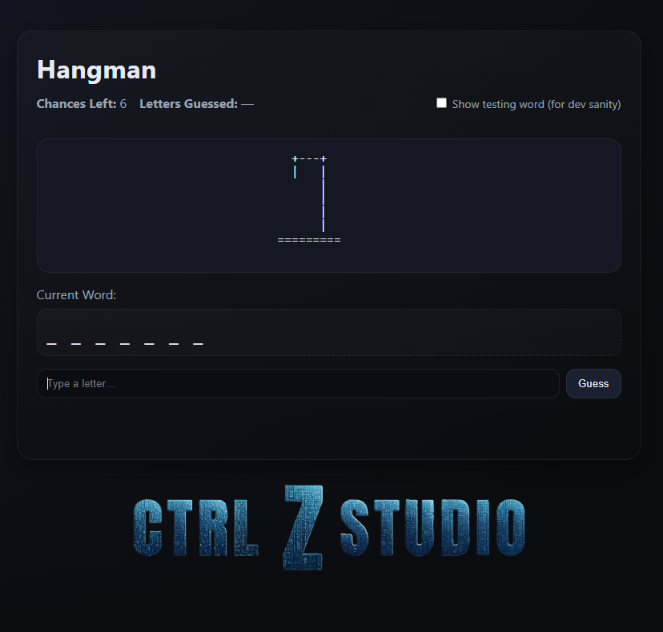

# 🎯 Hangman

A modern browser-based version of the classic **Hangman** word game — designed with a clean UI, smooth feedback, and built entirely with **HTML, CSS, and JavaScript** (no frameworks required).

---

## 📷 Preview



## 🧠 Overview

Test your guessing skills by uncovering a random fruit-themed word before running out of chances! Each incorrect guess adds to the ASCII art hangman until you either guess the full word or lose the game.  

Perfect as a simple web-based mini-game or a front-end coding exercise showcasing DOM manipulation and user input handling.

---

## 🚀 Live Demo

👉 [**Play Hangman Online**](#) _(<a src="https://hangman-v1.onrender.com/" target="_blank">Play Hangman</a>)_

---

## 🧰 Tech Stack

- **HTML5** — structure and accessibility
- **CSS3** — responsive design and dark-themed interface
- **JavaScript (ES6)** — core game logic and DOM updates

---

## 🗂️ Folder Structure

Hangman/
├── img/
│ └── ProfilePicR2.png
├── .gitignore
├── CtrlZStudioAlpha.png
├── index.html
├── script.js
└── styles.css


---

## 🕹️ Gameplay Features

- 🎮 **Interactive Gameplay:** Type letters or use the Guess button to reveal the word.
- 🧩 **Dynamic ASCII Art:** Visual feedback for every wrong guess.
- ⚡ **Instant Feedback:** “Good guess!” or “Try again” messages for each input.
- 🔄 **Restart Button:** Quickly reset the game and play again.
- 🧑‍💻 **Developer Mode:** Toggle to show the current testing word for debugging.
- 📱 **Mobile Friendly:** Optimized layout and typography for all screen sizes.

---

## 🧩 How to Play

1. Open the game in your browser.
2. Guess one letter at a time by typing or clicking **Guess**.
3. Each wrong guess reduces your chances and updates the ASCII art.
4. Win by guessing all letters correctly before running out of chances.
5. Click **Restart** to play again!

---

## 🧠 Code Highlights

- Uses an array of pre-set words (`words[]`) to randomize gameplay.
- Keeps track of:
  - ✅ `guessedLetters`
  - 💀 `chancesLeft`
  - 🔡 `display[]` (revealed letters)
- Handles input validation (A–Z only, one letter per turn).
- Accessible feedback using `aria-live` regions for screen readers.
- Clean, modular logic with helper functions:
  - `init()` — starts or restarts the game  
  - `handleGuess()` — core logic per guess  
  - `render()` — updates UI state  
  - `toast()` — displays in-game messages

---

## 🧱 Installation & Setup

To run locally:

```bash
# 1. Clone the repo
git clone https://github.com/yourusername/Hangman.git

# 2. Navigate into the project folder
cd Hangman

# 3. Open index.html in your browser
```
No dependencies or build steps required — it’s 100% vanilla front-end code.

---

## 🎨 Design Notes

- Dark gradient background inspired by modern game UIs.
- Responsive grid/flex layout.
- Simple but effective color system:
  - Accent Blue → for highlights
  - Green → for correct guesses
  - Red → for incorrect guesses

---

## 🧑‍💻 Author

**Tony Sotelo**
🎥 Video Editor | 💻 Web Developer | 🎮 Game Creator
<a src="https://portfolio-kj53.onrender.com/index.html" target="_blank">Portfolio</a> | <a src ="https://www.linkedin.com/in/tonysotelovfx/" target="_blank">LinkedIn</a> | <a src="https://github.com/TonySoteloCodeFX" target="_blank">GitHub</a>